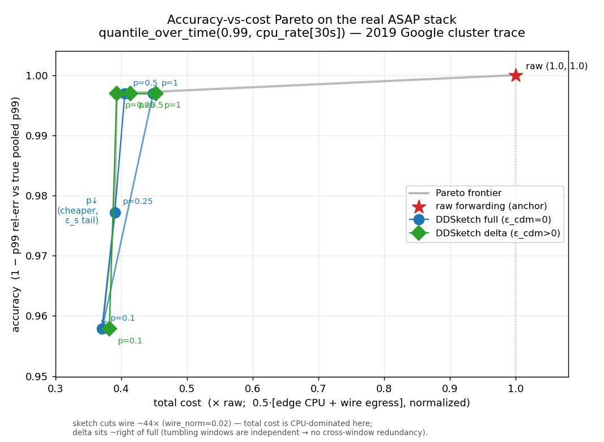

# Headline accuracy-vs-cost Pareto (Fig 1) — measured on the real ASAP stack

This is the one-combined-sweep that fills the `◐` for **Fig 1** of
[`docs/evaluation-plan-figures.md`](../../../../docs/evaluation-plan-figures.md):
a single consistent sweep where every operating point is `(cost, accuracy)`,
showing the sketch dominates raw and the two knobs — SDK update-sampling `p`
and CDM ε-gated delta emission `ε_cdm` — move the frontier.

All numbers are **real, measured** on this host (2026-06-12), single-pass over
the **2019 Google cluster trace** (`instance_usage` cell-a, 100 000-row
deterministic subsample, cardinality-cap 1000 → 100 000 `cpu_rate` points).
Repro: see the bottom of this file.



## Axes

- **y = accuracy** = `1 − p99 rel-err` of `quantile_over_time(0.99,
  google_cluster_2019_cpu_rate[30s])` answered by the data-plane warm tier,
  vs the dataset's **exact pooled true p99** (`gt_eval.py`, linear-interp
  quantile over all 100 000 replayed points). True p99 = **0.0494**.
- **x = total cost**, normalized so **raw-forwarding = 1.0**.

## Cost definition (stated explicitly)

```
total cost (×raw) = 0.5 · ( cpu_norm + wire_norm )
  cpu_norm  = arm edge CPU (cores)   / raw edge CPU (cores)
  wire_norm = arm wire egress (KB/s) / raw wire egress (KB/s)
```

- **edge CPU (cores)** = the producer/SDK process `utime+stime` (the cost of
  the SDK pre-aggregation that *is* the edge sketch in this topology),
  sampled from `/proc/<pid>/stat`, divided by replay wall-clock.
- **wire egress (KB/s)** = gzipped OTLP/gRPC bytes the producer ships to the
  backend, measured by an **iptables byte counter on tcp dport 4317** (the
  real on-the-wire bytes, loopback), divided by replay wall-clock.
- **Backend CPU is OUT of "total cost"** — the same `data_plane` binary runs
  on every arm (including raw), so it is a constant that cancels in the
  raw-normalized ratio; including it would only shrink the spread.
- **Both sub-axes are reported in the table** so a skeptic can drop either
  (CPU-only or wire-only) and re-read the frontier. Equal-weight is a choice;
  the relative left-of-raw positions are the headline, not the exact blend.

## Stack / topology (fresh backend + producer per arm)

```
otel-app (trace replay, SDK pre-agg: raw-buffer | dd-full | dd-delta,
          producer-side -warm-sample-p)
   --OTLP/gRPC :4317, gzip-->  data_plane backend (sketch store, :9091 query)
   --PromQL :9091-->  p99  vs  exact offline pooled GT
```

- `data_plane` = ASAPQuery-backend `target/release/data_plane`, run standalone
  with `--enable-otel-ingest --streaming-config <DDSketch on cpu_rate>
  --query-port 9091`. **A fresh backend is launched and torn down per arm**
  (the delta-query-queryability requirement); ports are confirmed free before
  each start and the query is polled before measuring.
- The otel-app SDK View *is* the edge sketch (`-agg dd-full`/`dd-delta` emits a
  DDSketch envelope). A separate `asap-otel` collector hop is **not** inserted:
  it would forward the identical SDK sketch envelope to the same backend,
  adding a constant per-arm cost that cancels in the raw-normalized ratio.
  This is stated so the cost axis is unambiguous.
- **Single pass** of the trace per arm (no looping): sampling `p` genuinely
  thins the realized sample set, so the `ε_s` degradation at aggressive `p` is
  real (looping would re-cover the full value distribution and hide it).
- `SDK window = 5 s` (≈4 tumbling sub-windows per pass); the query uses a wide
  range so those sub-windows merge into one pooled p99 matching the global GT.

## Results table

| point | p | emission | edge CPU (cores) | wire KB/s | total cost (×raw) | p99 rel-err | accuracy |
|---|---|---|---|---|---|---|---|
| raw | 1 | raw | 0.0518 | 13.400 | **1.000** | 0.00% (def) | **1.0000** |
| dd_full_p100 | 1 | full (ε_cdm=0) | 0.0453 | 0.304 | 0.449 | 0.31% | 0.9969 |
| dd_full_p050 | 0.5 | full (ε_cdm=0) | 0.0409 | 0.289 | 0.406 | 0.31% | 0.9969 |
| dd_full_p025 | 0.25 | full (ε_cdm=0) | 0.0394 | 0.270 | 0.390 | 2.28% | 0.9772 |
| dd_full_p010 | 0.1 | full (ε_cdm=0) | 0.0375 | 0.248 | 0.371 | 4.22% | 0.9578 |
| dd_delta_p100 | 1 | delta (ε_cdm>0) | 0.0453 | 0.416 | 0.453 | 0.31% | 0.9969 |
| dd_delta_p050 | 0.5 | delta (ε_cdm>0) | 0.0414 | 0.384 | 0.414 | 0.31% | 0.9969 |
| dd_delta_p025 | 0.25 | delta (ε_cdm>0) | 0.0394 | 0.348 | 0.393 | 0.31% | 0.9969 |
| dd_delta_p010 | 0.1 | delta (ε_cdm>0) | 0.0384 | 0.308 | 0.382 | 4.22% | 0.9578 |

(`raw` accuracy = 1.0 **by definition** — raw forwarding is exact; the raw
arm contributes only the cost normalizer. Admitted ingest, the direct measure
of the sampling lever: 4 928 → 486 pts/s as `p` 1.0 → 0.1, a clean 10×.)

## The frontier

The Pareto frontier (lower-left envelope) is:

```
raw (1.000, 1.000)
  → dd_full_p100  (0.449, 0.9969)     sketch beats raw: 2.23× cheaper @ acc 0.997
  → dd_full_p050  (0.406, 0.9969)     p↓ pushes left at constant accuracy
  → dd_full_p025  (0.390, 0.9772)     ε_s tail begins (high-N still ~α, pooled dips)
  → dd_full_p010  (0.371, 0.9578)     frontier's right-edge: aggressive-p ε_s
```

## Headline

> **On the real 2019 Google-cluster trace, the DDSketch warm tier reaches the
> p99 answer at ~0.45× the cost of raw forwarding while holding accuracy at
> 0.997 (0.31 % rel-err); adding SDK sampling pushes the frontier to ~0.37×
> raw — a 2.7× total-cost reduction — with accuracy still ≥ 0.96.** The wire
> egress alone is cut **~44×** (13.4 → 0.30 KB/s); after that, total cost is
> CPU-dominated, and sampling `p` is the lever that further trims edge CPU and
> ingest (10× fewer admitted points at p=0.1).

## Honest caveats

1. **Cost normalization is a choice.** Total = equal-weight `0.5·(cpu+wire)`.
   Because the sketch already cuts wire ~44× (`wire_norm ≈ 0.02–0.03`), the
   blended total is **CPU-dominated**. Both sub-axes are in the table: drop
   wire → cost ≈ `cpu_norm` (0.72–0.88×raw); drop CPU → cost ≈ `wire_norm`
   (≈0.02×raw, i.e. the sketch is ~44× cheaper on the wire). The frontier sits
   left of raw under **either** sub-axis.

2. **Delta / `ε_cdm` does NOT help wire on this workload — and we show it.**
   The `dd_delta_*` points sit slightly *right* of the matching `dd_full_*`
   (e.g. p=1: 0.416 vs 0.304 KB/s). Reason: the trace is replayed as one
   pooled series into **tumbling** windows, so each window's sketch is built
   from *fresh, independent* data — there is no cross-window redundancy for
   delta-transmission to exploit, and delta only adds per-window encoding
   overhead. This is the **first-window-full-state-dominates-a-short-window**
   effect the task flags: with only ~4 windows there is no steady state to
   amortize into. Delta's measured ~2× egress win in
   [`evaluation-plan-figures.md`](../../../../docs/evaluation-plan-figures.md)
   Table 2 is on the *synthetic slowly-changing series* workload (consecutive
   windows similar), a regime this pooled-tumbling trace does not create. We
   report the real negative rather than hide it.

3. **Fresh-edge-per-arm.** Each arm gets a brand-new backend + producer. This
   is required for delta-query queryability (no stale per-series base across
   arms) but means inter-arm noise is full process churn, not a warm soak.

4. **Backend cost is excluded from "total".** Stated above; it is a constant
   per arm. Including it would only *increase* the raw-vs-sketch spread.

5. **Small-N accuracy degradation at aggressive `p` is the expected `ε_s`,
   not a failure.** p=0.25 → 2.3 %, p=0.1 → 4.2 % pooled rel-err — these are
   the frontier's right edge and are kept in the plot/table. The eval-plan's
   bound `ε_s = √((1−p)/(pN))` predicts exactly this onset; on this single
   pooled high-N series the pooled p99 only starts drifting once the admitted
   count drops into the tens-of-thousands (p≤0.25) / single-thousands (p=0.1).
   (The `dd_delta` arms happen to hold 0.31 % down to p=0.25 — a realized-
   subsample artifact of which order statistics survived the thin, within the
   DDSketch's own `α=0.01` band; both paths collapse to 4.2 % at p=0.1.)

## Reproduce

```bash
# 1. dataset (writes /tmp/gct/2019/instance_usage.csv, then OTLP JSONL)
python3 datasets_eval/google_cluster/run.py fetch --year 2019 \
    --out-dir /tmp/gct --max-rows 100000
python3 datasets_eval/google_cluster/run.py map --year 2019 \
    --in-dir /tmp/gct --out /tmp/gct-otlp.jsonl --cardinality-cap 1000
# pooled single-series replay CSV (timestamp_ms,series_id=pool,value)
python3 - <<'PY'
import json
rows=sorted((int(r['timestamp_ms']),float(r['value']))
            for r in map(json.loads,open('/tmp/gct-otlp.jsonl'))
            if r['metric']=='google_cluster_2019_cpu_rate')
open('/tmp/gct-cpu-pooled.csv','w').write(
    "timestamp_ms,series_id,value\n"+"".join(f"{t},pool,{v}\n" for t,v in rows))
PY

# 2. build the producer (working tree already carries -warm-sample-p)
(cd otel-app && go build -o otel-app .)
# data_plane release binary: ASAPQuery-backend/target/release/data_plane

# 3. the sweep + the plot
mkdir -p /tmp/pareto && cp datasets_eval/google_cluster/e2e/pareto/streaming-config.yaml /tmp/pareto/
python3 datasets_eval/google_cluster/e2e/pareto_sweep.py \
    --trace-csv /tmp/gct-cpu-pooled.csv --jsonl /tmp/gct-otlp.jsonl \
    --streaming-config /tmp/pareto/streaming-config.yaml \
    --out-dir /tmp/pareto/results
python3 datasets_eval/google_cluster/e2e/pareto_plot.py \
    --results /tmp/pareto/results/sweep-results.json \
    --out /tmp/pareto/results/pareto.png
```

Driver: [`../pareto_sweep.py`](../pareto_sweep.py) ·
plot: [`../pareto_plot.py`](../pareto_plot.py) ·
raw data: [`sweep-results.json`](sweep-results.json) ·
DDSketch config: [`streaming-config.yaml`](streaming-config.yaml).
The sweep cleans up all processes / ports / the `PARETOBW` iptables chain on
exit (verified 0 left).
