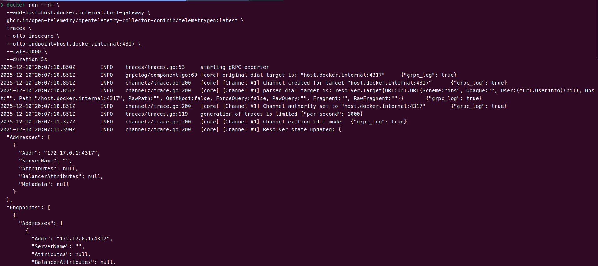
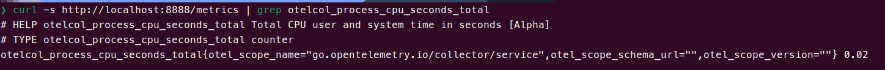
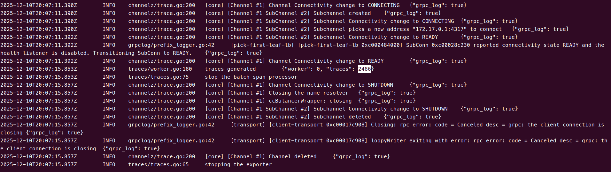
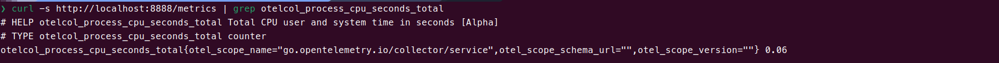
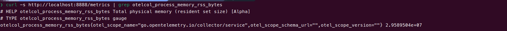
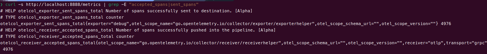

# OpenTelemetry Custom Processor Benchmark

Custom OpenTelemetry Collector distribution with a  a baseline processor (`nopprocessor`).

## 1. Prerequisites

* **Go** (1.23+) installed.
* **Docker** (for running the load generator).
* **Builder Tool** installed (or `go install go.opentelemetry.io/collector/cmd/builder@latest`).

## 2. Build the Collector

Run the builder to compile your custom binary from the source code.

```bash
builder --config builder-config.yaml
```

- **Output:** The binary will be located at `./dist/nopcol`.

## 3. Run the Benchmark

### Step A: Start the Collector

Open Terminal 1 and run your custom binary:

```bash
./dist/nopcol --config config.yaml
```

### Step B: Generate Load (Telemetrygen)

Open Terminal 2. This command sends **10,000 traces/sec** for **30 seconds**.

**For Linux:**

```bash
docker run --rm \
  --add-host=host.docker.internal:host-gateway \
  ghcr.io/open-telemetry/opentelemetry-collector-contrib/telemetrygen:latest \
  traces \
  --otlp-insecure \
  --endpoint=host.docker.internal:4317 \
  --rate=10000 \
  --duration=30s
```

**For Mac/Windows:**

```bash
docker run --rm \
  ghcr.io/open-telemetry/opentelemetry-collector-contrib/telemetrygen:latest \
  traces \
  --otlp-insecure \
  --endpoint=host.docker.internal:4317 \
  --rate=10000 \
  --duration=30s
```



## 4. Benchmark

### CPU Usage

The CPU metric (`otelcol_process_cpu_seconds_total`) is a Cumulative Counter. It never resets. To measure your processor's cost, you must record the value before and after the test, then subtract them.

**Step A: Start the Collector**

Open Terminal 1 and run your custom binary:
```
./dist/nopcol --config config.yaml
```

**Step B: Record "Start" CPU**

Before sending any load, run this in Terminal 2 to get your baseline number:
```
curl -s http://localhost:8888/metrics | grep otelcol_process_cpu_seconds_total
```



    Example from test: 0.02

**Step C: Generate Load (Telemetrygen)**

Run this command to send load.

**For Linux:**
```
docker run --rm \
  --add-host=host.docker.internal:host-gateway \
  ghcr.io/open-telemetry/opentelemetry-collector-contrib/telemetrygen:latest \
  traces \
  --otlp-insecure \
  --endpoint=host.docker.internal:4317 \
  --rate=10000 \
  --duration=30s
```
**For Mac/Windows:**
```
docker run --rm \
  ghcr.io/open-telemetry/opentelemetry-collector-contrib/telemetrygen:latest \
  traces \
  --otlp-insecure \
  --endpoint=host.docker.internal:4317 \
  --rate=10000 \
  --duration=30s
```

 

**Step D: Record "End" CPU & Calculate**

Immediately after the Docker command finishes, run the curl command again:
```
curl -s http://localhost:8888/metrics | grep otelcol_process_cpu_seconds_total
```

 

    Example from test: 0.06


We use the Delta Calculation because the metric is a counter that always increases.
```
    Formula: Total Cost=END−START

    Calculation: 0.06−0.02=0.04 seconds

    Conclusion: The nop processor used only 0.04s of CPU time to process the entire batch, confirming a highly efficient baseline.
```

### Memory Usage

This metric is a Gauge (Current Usage).

  - Metric: otelcol_process_memory_rss_bytes
  - Command:

  ```
    curl -s http://localhost:8888/metrics | grep otelcol_process_memory_rss_bytes
```

 

    Actual Output: 2.9589504e+07


The raw number is in bytes. We verify it by converting to a readable unit.

  - Calculation: 29,589,504 bytes÷1,048,576≈28.2 MB.
  - Conclusion: 28MB is a standard, lightweight footprint for an idle Go process.

### Throughput (Data Integrity)

Verify that the collector actually processed the items you sent.

  - Metric (Receiver): `otelcol_receiver_accepted_spans_total` (What entered the pipeline)
  - Metric (Exporter): `otelcol_exporter_sent_spans_total` (What left the pipeline)
  - Command:
```
curl -s http://localhost:8888/metrics | grep -E "accepted_spans|sent_spans"
```

 

  - Actual Output: otelcol_receiver_accepted_spans_total = otelcol_exporter_sent_spans_total = 4972
  - This proves the nopprocessor successfully received every span and passed it to the exporter without dropping a single item.

You might notice that telemetrygen reported sending 2,486 items, but the Collector reports receiving 4,972. The math proves this is correct behavior, not a bug.
  - Input: telemetrygen counts Traces. By default, it generates 1 Trace containing 2 Spans (Parent + Child).
  - Output: The Collector counts Spans.
  - Verification:
    2,486 Traces×2 Spans/Trace=4,972 Spans

Since the numbers match exactly, we have proven zero data loss and zero duplication.